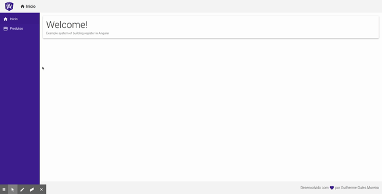

<h1  align="center">Angular Essential</h1>

<h2 align="center">Layout</h2>

## What is used in this project
- [Angular material](https://material.angular.io/)
- [Angular 9](https://angular.io/)
	- Services
	- Routes
		- Lazy-loading
	- Directives
- [json-server](https://github.com/typicode/json-server) 
  

## How run:
-  `npm install` or `yarn` install all dependencies

- `npm start`  or `yarn start` to run the application;

- `npm run api` or `yarn api` to run json-server with data;

- `npm test` or `yarn test` to run unit tests;

## To Do:

- [] add Docker and docker-compose;
- [] add unit tests with Jest;
- [] add e2e tests with cypress;

## Why use Jest? (Benefits compared to Karma + jasmine)

- CLI: filter by a filename or test name regex pattern (reducing the need for fdescribe) and rerun tests

- Executing tests without building the whole app allows to run our tests faster

- Low configuration needed to get started

- Clear documentation which makes it easy to adjust Jest to your needs

- Testing is stable: no more sudden test runner failures while writing tests

- You can keep most of the Jasmine syntax because Jest includes most of the Jasmine API in addition to its own API

- Snapshot testing, a useful feature which is not available in Jasmine

- More active community which will make Jest even better
